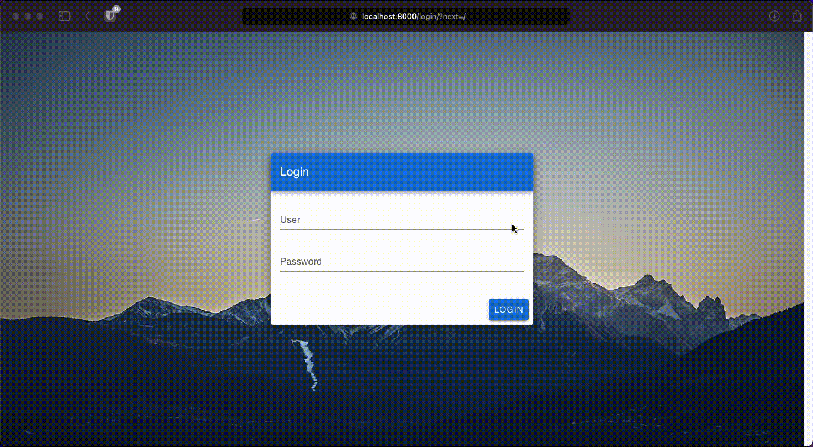

# Django + Vuetify + GraphQL

A Django framework that integrates Vue.js with Vuetify and GraphQL with as little complexity as possible. 

Great for prototyping and to get started quickly! 🚀



## What is it about?

This is an opinionated framework that integrates [Vue.js](https://github.com/vuejs/vue) with [Vuetify](https://github.com/vuetifyjs/vuetify) directly into [Django](https://github.com/django/django). 
The Vue.js application is embedded using the Django template engine and [GraphQL](https://graphql.org) is preconfigured for backend communication. 
All requests are secured via Django's standard session-based authentication framework, CSRF cookies are also configured for GraphQL requests. 
For login the standard view from `django.contrib.auth` is used, although the form gets rendered by Vuetify.
To make file uploads as easy as possible from the frontend, [graphene-file-upload](https://github.com/lmcgartland/graphene-file-upload) is also on board.

In a nutshell:

* All the security and database mapping of Django
* All the flexibility and reactiveness of Vue.js
* All the handy pre-styled components from vuetify
* All the API awesomeness of GraphQL

If you like, feel free to fork, contribute or [buy me a coffee](http://ko-fi.com/philipptrenz) ☕️

## Get started

### Setup

```bash
# Install Python dependencies
pip -r requirements.txt

# Create sqlite3 database and apply migrations
./manage.py migrate

# Install Vue dependencies
cd frontend
yarn install
cd ..

# Create an admin account
./manage.py createsuperuser
```

### Run 

```bash
# Run development server
./manage.py runserver

# Run frontend in dev mode
cd frontend
yarn serve
```

### Build

```bash
# Build frontend
cd frontend 
yarn build

# Collect static files
cd ..
./manage.py collectstatic
```
